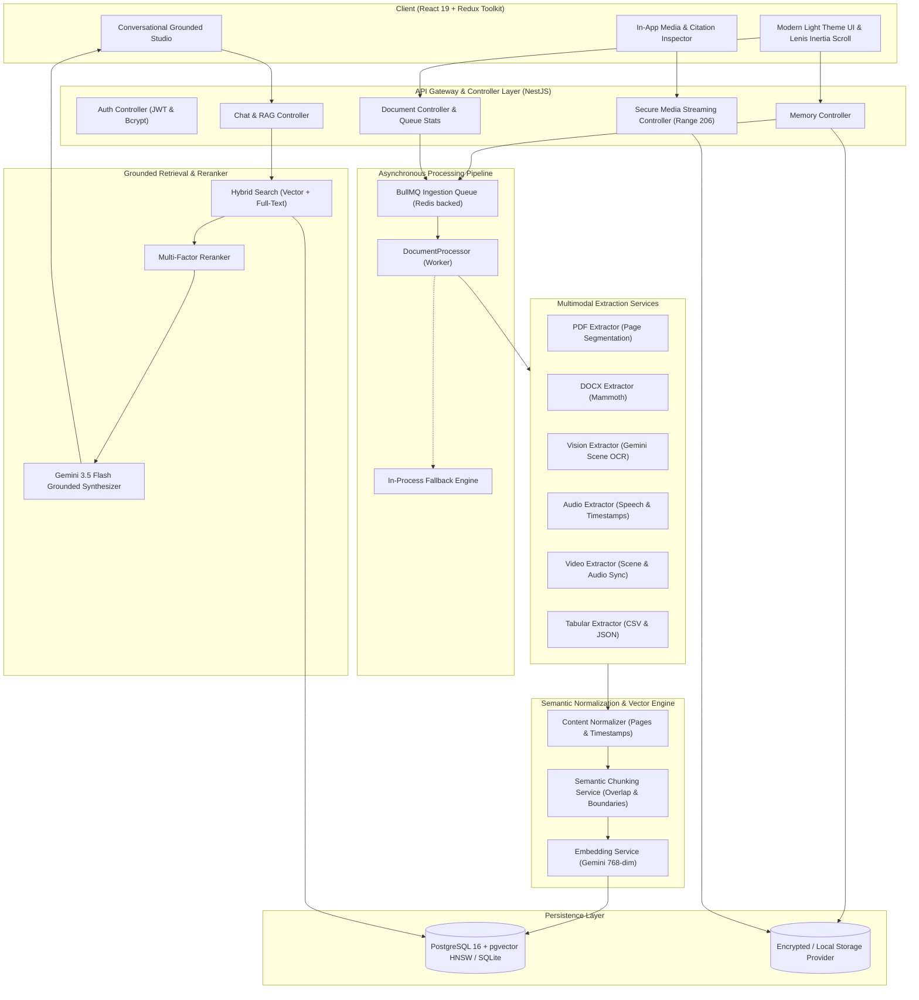
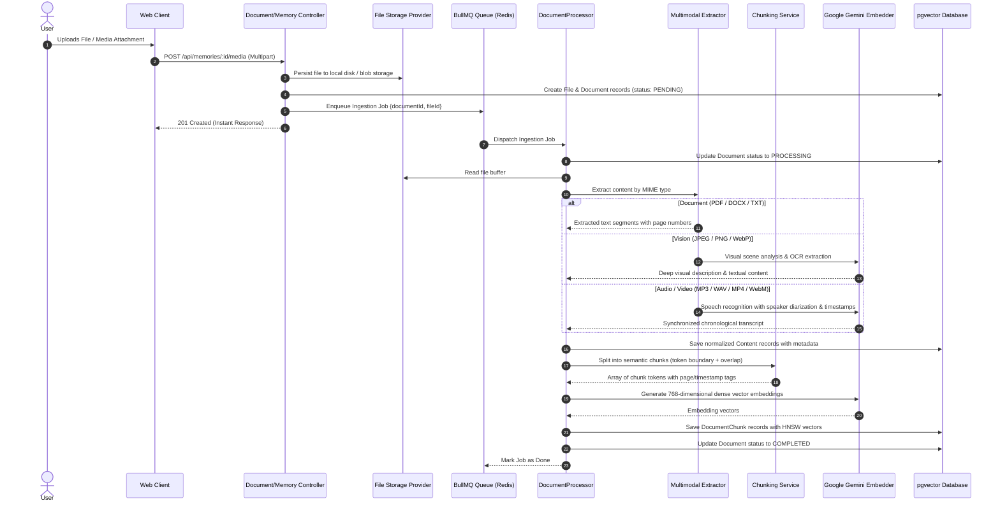
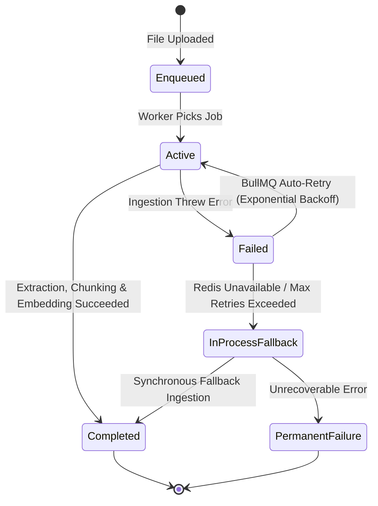
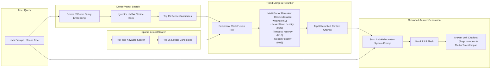
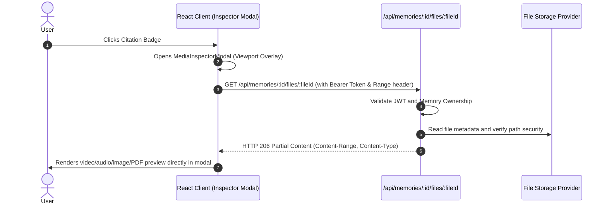
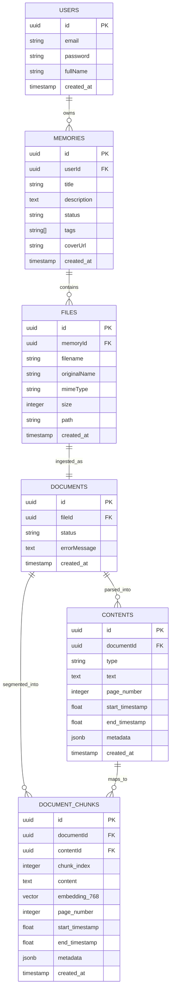

# Chronicle AI

Chronicle AI is an enterprise-grade multimodal personal knowledge and memory management platform. It transforms personal journals, files, documents, visual assets, audio recordings, and videos into an interactive, grounded knowledge base queried through an evidence-traceable conversational AI interface.

---

## 1. System Architecture

Chronicle AI decouples heavy multimodal file extraction and embedding generation from the HTTP request-response cycle using an asynchronous queue architecture powered by **BullMQ** and **Redis**, backed by **PostgreSQL with pgvector** (or embedded SQLite for lightweight environments), **Google Gemini 3.5 Flash**, and a high-performance **React 19** client.



---

## 2. Multimodal Extraction & Ingestion Pipeline

When media or documents are uploaded, Chronicle AI immediately persists the raw file and delegates processing asynchronously through BullMQ. The system extracts structured semantic representations regardless of input modality.



### Supported Modalities

| Modality | Formats | Processing Method | Metadata Extracted |
|---|---|---|---|
| **Text Documents** | `.txt`, `.md`, `.json`, `.csv`, `.html` | Native string parsing & tabular parsing | Row keys, headers, hierarchical headings |
| **PDF Documents** | `.pdf` | `pdf-parse` with page segmentation | Page numbers, physical layout preservation |
| **Word Documents** | `.docx` | `mammoth` document translation | Paragraph styling, document hierarchy |
| **Images** | `.jpg`, `.jpeg`, `.png`, `.webp`, `.gif` | Gemini 3.5 Flash Vision OCR & Scene Description | Object recognition, scene semantics, visible text |
| **Audio** | `.mp3`, `.wav`, `.ogg`, `.m4a` | Gemini Multimodal Audio Transcription | Speaker identification, start/end timestamps |
| **Video** | `.mp4`, `.webm`, `.mov`, `.mkv` | Gemini Multimodal Video Chronological Decomposition | Scene progression, action logs, audio transcript |

---

## 3. BullMQ Queue Architecture & Worker Resilience

Background multimodal extraction is isolated from web server threads:



- **Redis-Backed Job Queue**: BullMQ manages concurrency, job prioritization, and retries with exponential backoff.
- **In-Process Fallback Engine**: If Redis is not connected or in local development environments, the worker falls back gracefully to in-process execution without dropping ingestion tasks.
- **Live Queue Monitoring**: Health and throughput statistics are accessible at `GET /api/documents/queue/stats` (active, waiting, completed, and failed counts).

---

## 4. Grounded RAG Retrieval & Multi-Factor Reranking

Chronicle AI enforces strict grounding to ensure hallucination-free answers backed by verifiable source citations.



### Citation & Source Traceability
Every assertion synthesized by the assistant links back to the exact chunk where the knowledge originated:
- **Documents & PDFs**: `[annual-report.pdf - Page 12]`
- **Audio Files**: `[team-standup.mp3 at 04:32]`
- **Video Files**: `[lecture-clip.mp4 at 14:05]`
- **Images & Photos**: `[whiteboard-architecture.png]`

---

## 5. Security & Safe Media Streaming

Chronicle AI protects uploaded assets through an authenticated streaming pipeline:



- **Zero Direct Server Links**: File paths and raw server URLs are never exposed. Media is served exclusively through authenticated NestJS streaming endpoints.
- **HTTP 206 Partial Content**: Video and audio streaming supports seekable byte ranges for instant scrubbing without downloading full files.
- **In-App Media Inspector Modal**: Modal renders via `createPortal` with global Lenis scroll locking, ESC key dismissal, and responsive media viewers.

---

## 6. Database Entity Relationship Model



---

## 7. Frontend Architecture & User Experience

- **React 19 & TailwindCSS**: Modern light-theme design system featuring rounded surfaces, subtle slate borders, and vibrant Indigo/Violet accents.
- **Lenis Momentum Scrolling**: Single global Lenis instance initialized at application root (`App.tsx`), providing continuous inertia scrolling across the dashboard, memory detail, and full-page chat.
- **Sticky Glassmorphic Composer**: Floating chat input bar with backdrop blur and gradient fade, keeping prompts accessible while scrolling through lengthy conversations.
- **Redux Toolkit**: Centralized state management for authentication, memory collections, and asynchronous background ingestion jobs.

---

## 8. API Reference

### Authentication
- `POST /api/auth/register` — Create new account
- `POST /api/auth/login` — Authenticate and receive JWT cookie/token
- `GET  /api/auth/me` — Retrieve current authenticated user profile

### Memories
- `POST   /api/memories` — Create a new memory
- `GET    /api/memories` — List user memories (supports `?recent=true&limit=N`)
- `GET    /api/memories/:id` — Retrieve memory details with media attachments
- `PATCH  /api/memories/:id` — Update memory title, description, or tags
- `DELETE /api/memories/:id` — Delete memory and cascade associated files
- `GET    /api/memories/:id/summary` — Generate AI summary of memory events and decisions
- `GET    /api/memories/:id/search` — Execute hybrid search scoped to specific memory

### Files & Streaming
- `POST   /api/memories/:id/media` — Upload file attachment or create text note
- `PATCH  /api/memories/:id/media/:mediaId` — Update attachment metadata or note content
- `DELETE /api/memories/:id/media/:mediaId` — Delete attachment
- `GET    /api/memories/:id/files/:fileId` — Authenticated stream of media (supports HTTP 206 Partial Content)

### Ingestion & Background Queue
- `GET    /api/documents/:id` — Retrieve document processing status, contents, and chunks
- `GET    /api/documents/:id/status` — Poll document extraction state
- `POST   /api/documents/:id/reprocess` — Re-enqueue document for multimodal processing
- `GET    /api/documents/queue/stats` — BullMQ queue throughput and waiting/active metrics

### Grounded Search & Conversational Studio
- `POST   /api/search` — Global hybrid search across all memories
- `POST   /api/chat` — Conversational grounded RAG query with citations
- `POST   /api/chat/memory/:id` — Conversational grounded RAG scoped to a single memory

---

## 9. Local Development Setup

### Prerequisites
- **Node.js**: 20+ or 22+
- **Redis**: 7+ (optional; in-process fallback activates automatically if unavailable)
- **PostgreSQL 16 with pgvector** (or embedded SQLite for rapid development)
- **Google Gemini API Key**

### 1. Clone & Install Dependencies

```bash
# Clone the repository
git clone https://github.com/Next-Gen-Coder-2007/Chronicle.git
cd Chronicle

# Install backend dependencies
cd server
npm install

# Install frontend dependencies
cd ../client
npm install
```

### 2. Configure Backend Environment

Create `server/.env`:

```env
PORT=5000
NODE_ENV=development
FRONTEND_URL=http://localhost:5173

# Database configuration (SQLite or PostgreSQL with pgvector)
DATABASE_URL=sqlite://chronicle.sqlite
DATABASE_SSL=false

# Redis Configuration (for BullMQ queue)
REDIS_HOST=localhost
REDIS_PORT=6379

# JWT Authentication
JWT_SECRET=chronicle_dev_secret_key_change_in_production
JWT_EXPIRES_IN=7d

# Google Gemini API
GEMINI_API_KEY=your_gemini_api_key_here
GEMINI_MODEL=gemini-3.5-flash
EMBEDDING_MODEL=gemini-embedding-001

UPLOADS_DIR=uploads
```

### 3. Run Development Servers

```bash
# Terminal 1 - Backend API (NestJS with watch mode)
cd server
npm run start:dev

# Terminal 2 - Frontend SPA (Vite dev server)
cd client
npm run dev
```

Open `http://localhost:5173` in your browser.
